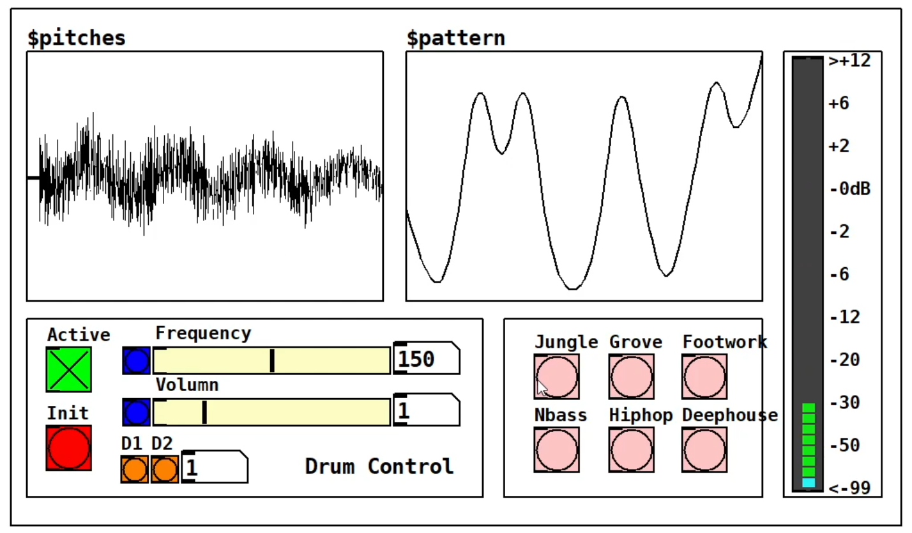
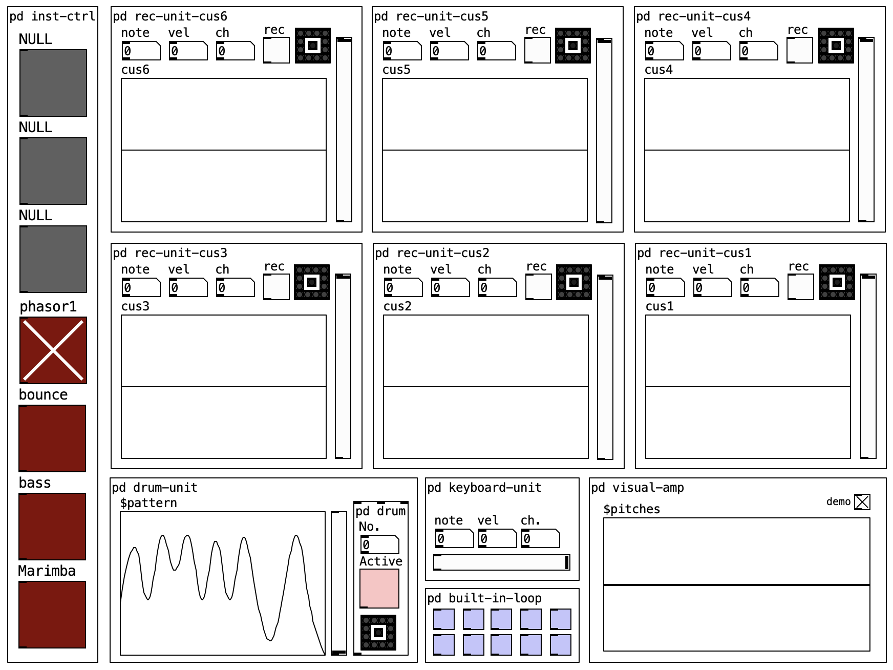
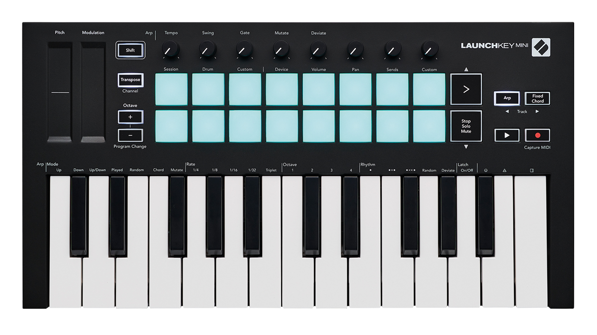
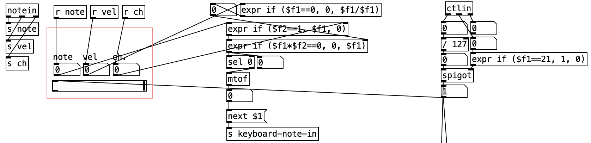
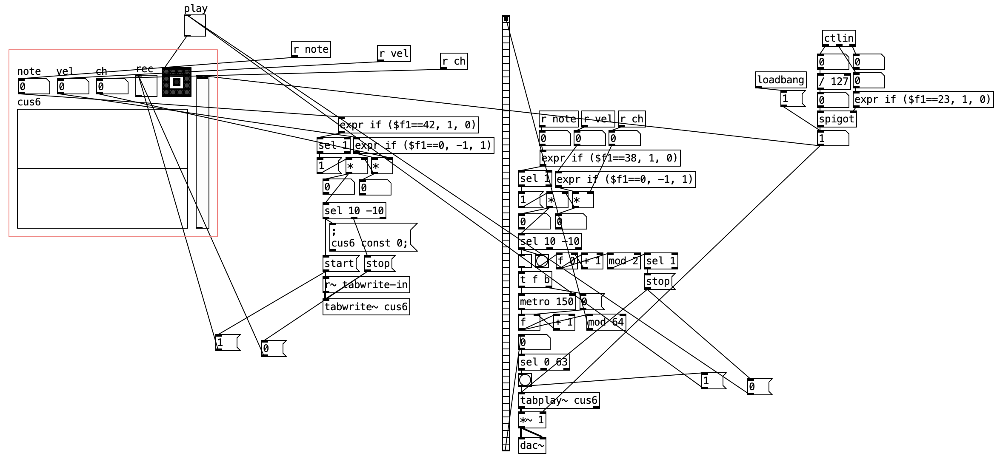
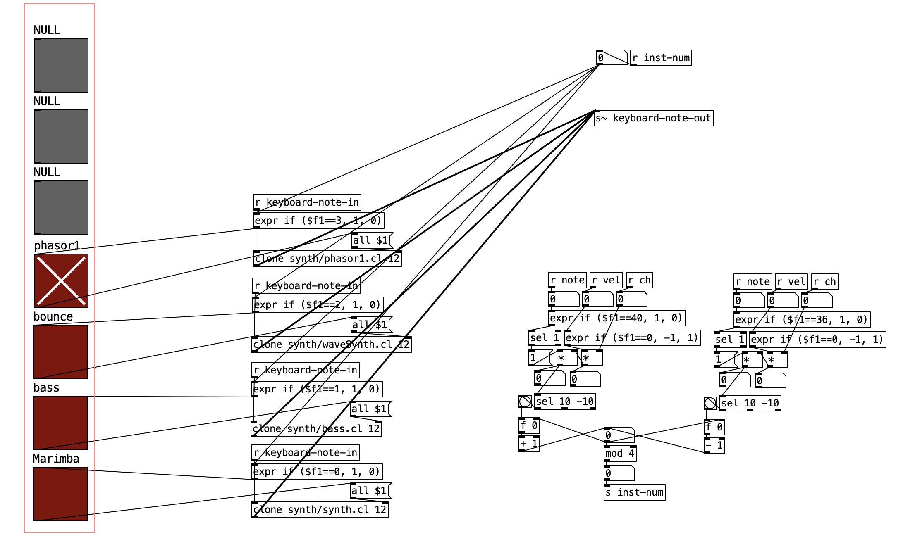
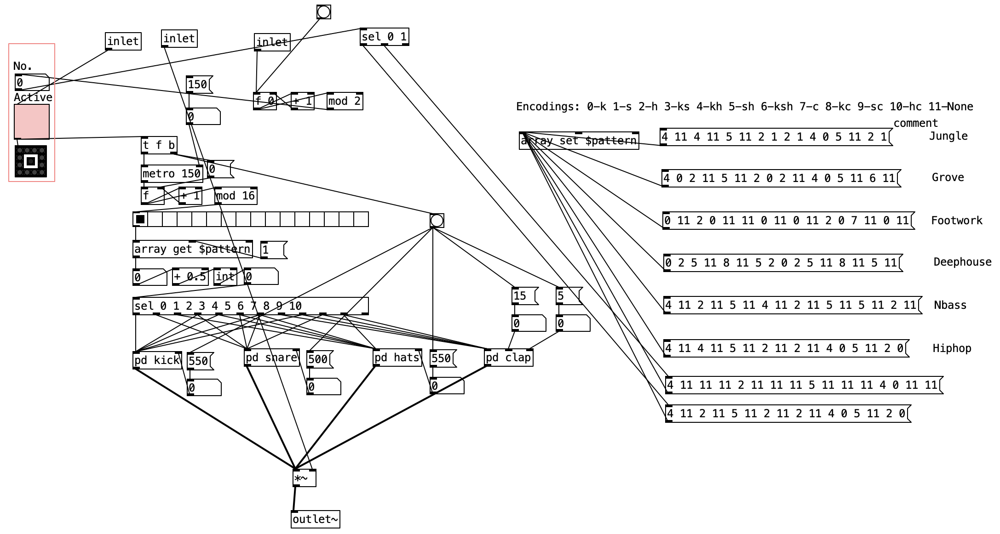

# pure-data-loop-pedal
A Loop Pedal Project in Pure Data 

## Platform
Prue-data: https://github.com/pure-data/pure-data

## Drum Kit Interface
I packed the drum machine into an interface and added new functionalities onto the interface, making it more user-friendly. 

 *drum kit interface*

Let's break down each feature in the interface:

1. Acoustic wave & Drum pattern visualizer: The top left part, visualise the drum wave in real-time. The top right array demonstrate the pattern of a drum in sequencing, the range of y-axis is 0~11, with each number mapped to one combination of drum kits. The very right bar is the VU meter visualizing the amplitude.

2. Control pannel: The bottom two pannels are the control pannels, one can activate/deactivate the drum, adjust the frequency and volumn, and change among different drum patterns, this integration has six drum patterns built in, and two drum sets provided (D1 & D2) for user.

## The Midi Loop Pedal
The prototype for my final performance. This project is completely powered by pure data and original. In order to use the pd file, the computer should be connected to Novation Launchkey Mini MK3 device because all functionalities are mapped to specific keys of this device.

 *looper interface*

 *Novation Launchkey Mini MK3*

### Midi Input
The input is the most basic function of a loop pedal yet the most important, there is basically two types of input in my keyboard: keys and knobs. Below is my implementation of input unit.

 *input unit*

Typically, we use notein object to receive key-type input and ctlin object to receive knob-type input. Some useful notes:

1. Key Input: The notein object receive the midi signal (omni) and convert which to three numbers, respectively note, velocity and channel. The note specifies the pitch and can be converted to frequency by ftom object. The velocity stand for the strength you press the key. The channel, typically range from 1 to 16, hels distinguish different parts of a midi keyboard (e.g. the pads and the keys are in different channels). Normally the pads and keys can share the same note numbers, thus (note, channel) can be an unique identifier for a specific key.

2. Knob Input: Very similar to key input but the "velocity" changed to "controller#". Now we distinguish different knobs not using the (note, channel) identifier but (controller#, channel) identifier, one reason is that notes of all knobs can be exactly same since they have same range, another reason is the "controller#" tells exactly knob number in one part of keyboard. Hence in implementation, we pass the "controller#" number to a spigot to control the opening and closing of this knob component in different positions. 

3. Spigot: Spigot object is very useful, if the right input is 1 then the left input is passed through, otherwise the left input will be blocked. Initially I don't know there is one object like that, so I implemented my own spigot, I would like to share, demonstrated below. 999 can be anything, you can replace it with channel number, or just toggle output (i.e. 1 or 0).
 *spigot implementation*

### Record Unit
One person can record the input keys and play the record using the record unit, there are in total six record unit in this interface, each unit is mapped to two pads and one knob on the midi keyboard, typically two consecutive pads above and below, the above pad control the "record" (one should HOLD the above pad to record) and the below pad control the "play" (one should TAP the pad to play/pause) function, the knob control the volumn of replay.

 *record unit implementation*

As you can see in above image, there are three distinct parts in the implementation, the left part is the record control, it records information about the sound waves played through the built-in instruments, usually the output of the oscillator, and records them in an array using tabwrite~. The middle part is the replay control, it plays the recorded array using tabread~. The right part is the volumn control.

### Instrument Control Unit

One can choose among different built-in instrument through instrument-control unit, which is the very left toggle bar of the interface. The bind keys in the midi keyboard are two pads, meaning the up key and down key. By tapping these two keys, one can choose the desired selection, in this demo, I allocate 7 instrument space for extension and 4 of them are already preseted.

 *inst unit implementation*

The implementation is easy and straightforward, mainly two distinct parts, the left part are built in instrument, the polyphonic synth is achieved using "clone" object, for each inst, I give 12 instances since two much instances could stress out the computer and 12 is enough for a small keyboard. The right part is the pad control, when the left pad is tapped, the number in this unit increase by 1, and when the right pad is tapped, it decrease by 1, number (as inst-num) is send to the left part to pick the instrument with corresponding instrument number.

### Drum Unit

This unit is the direct copy of "Drum Kit Interface". The detailed explanation on how it works can be found in my portfolio 1.

 *drum unit implementation*

### Drawbacks and Future Work

In a typical piano kit, the sound effect of long holding a key or touching/tapping a key is completely different, holding a key should result in longer sound delay and tapping on the contrary. In my implemetation, they all have the same delay (all considered as tap), so one future work is to implement the hold-key functionality.
