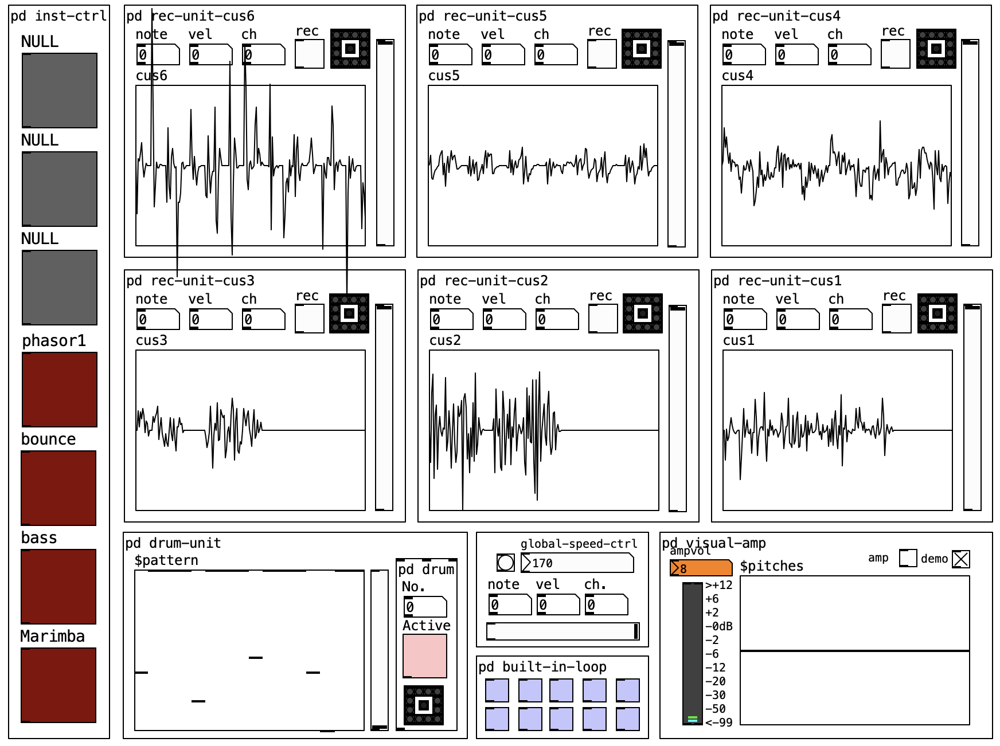
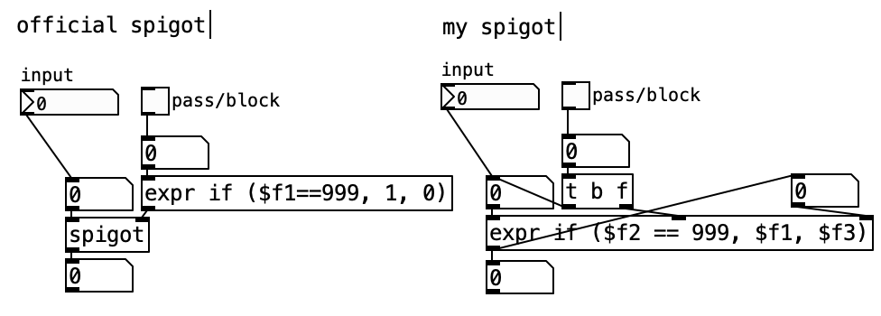

# Pure data loop pedal

## Description
This patch is a pure data based cross-platform performance interface specially designed for Novation Launchkey Mini MK3 that I developed independently. The files are also available and will be consistently updated on GitHub [<https://github.com/ljxw88/pure-data-loop-pedal>]. This is also a Laptop Ensemble artefact created as part of the _LENS_ ANU Laptop Ensemble '21 cohort.

## Platform
Pleased install **Prue-data** following the instruction in below websites:
- Github Page: https://github.com/pure-data/pure-data
- Community: https://puredata.info/

## User manual (READ BEFORE USE)

The interface is designed completely within the built in pure data widget. In order to use this pd patch, the computer should be connected to **Novation Launchkey Mini MK3** device because all functionalities are bound to specific keys of this device.

 *looper interface*

 *Novation Launchkey Mini MK3*

### Key bind

 *Interface key bind*

### 1. Lets fist play some music

This patch has initially 4 instrument built in and one can easily extend more. One can **TAP** key.(1) and key.(9) to switch among instruments (normally key.(1) denotes the "up" arrow key and key.(9) denotes the "down" arrow key). key.(k1) controls the volumn of output. When switched to porper instrument, we can start to record looping body.

### 2. Drum kit

 *drum unit*

This parch has 2 drum pattern built in, one can easily extend by swapping different drum patterns. key.(2), key.(10) and key.(k2) are for drum control. One can **TAP** key.(2) to start/stop the drum looping, and **TAP** key.(10) to switch among drum patterns. key.(k2) controls the volumn of drum. 

### 3. How to record & play

The record keys are in the pad section: key.(3)~key(8) for record and key.(11)~key(16) for play/stop. **One column** of keys are in one group, for example, key.(3) and key.(11) are in one group, key.(4) and key.(12) are in one group. So two keys in a group.

To record, one should **HOLD** the upper key in one specific group, for instance, in group1(key.(3) and key.(11)), hold key.(3) and play the midi keys, the record unit will record what you played (as a voice file, not midi notes). **RELEASE** the record key when you finish. If some sound wave appears on your record unit, it means your record is successful.

 *Record successful*

To play the record, one should **TAP** the lower key. Tap once will start the playback, tap twice will halt (not pause) the playback. When we stop and restart the playback, it will always start from the beginning not from the middle.

 *status indicator*

This patch has six record slot in total the knobs key.(k3)~key.(k8) are individual control of volumn of each playback slot. One can record up to six parts for the harmony.

### 4. Global speed

 *global speed control*

One can control the global speed of this looper by tweak the global-speed-ctrl number object, by default the global speed is set to 170, which is the input parameter of a metro object. As a reminder, this parameter sets the rate in msec per tick or tempo unit length, the higher the faster. The total length of looping body is 64, which means once the metro counted 64 times, it will cut-off all the playing music and return to the beginning. This is hard to accurately measure, I hope the user could tune the speed to get the optimum.

## Design (some gossips and not important...)

### Midi Input
The input is the most basic function of a loop pedal yet the most important, there is basically two types of input in my keyboard: keys and knobs. Below is my implementation of input unit.

 *input unit*

Typically, we use notein object to receive key-type input and ctlin object to receive knob-type input. Some useful notes:

1. Key Input: The notein object receive the midi signal (omni) and convert which to three numbers, respectively note, velocity and channel. The note specifies the pitch and can be converted to frequency by ftom object. The velocity stand for the strength you press the key. The channel, typically range from 1 to 16, hels distinguish different parts of a midi keyboard (e.g. the pads and the keys are in different channels). Normally the pads and keys can share the same note numbers, thus (note, channel) can be an unique identifier for a specific key.

2. Knob Input: Very similar to key input but the "velocity" changed to "controller#". Now we distinguish different knobs not using the (note, channel) identifier but (controller#, channel) identifier, one reason is that notes of all knobs can be exactly same since they have same range, another reason is the "controller#" tells exactly knob number in one part of keyboard. Hence in implementation, we pass the "controller#" number to a spigot to control the opening and closing of this knob component in different positions. 

3. Spigot: Spigot object is very useful, if the right input is 1 then the left input is passed through, otherwise the left input will be blocked. Initially I don't know there is one object like that, so I implemented my own spigot, I would like to share, demonstrated below. 999 can be anything, you can replace it with channel number, or just toggle output (i.e. 1 or 0).
 *spigot implementation*

### Record Unit
One can record the input keys and play the record using the record unit, there are in total six record unit in this interface, each unit is mapped to two pads and one knob on the midi keyboard, typically two consecutive pads above and below, the above pad control the "record" (one should HOLD the above pad to record) and the below pad control the "play" (one should TAP the pad to play/pause) function, the knob control the volumn of replay.

 *record unit implementation*

As you can see in above image, there are three distinct parts in the implementation, the left part is the record control, it records information about the sound waves played through the built-in instruments, usually the output of the oscillator, and records them in an array using tabwrite~. The middle part is the replay control, it plays the recorded array using tabread~. The right part is the volumn control.

### Instrument Control Unit

One can choose among different built-in instrument through instrument-control unit, which is the very left toggle bar of the interface. The bind keys in the midi keyboard are two pads, meaning the up key and down key. By tapping these two keys, one can choose the desired selection, in this demo, I allocate 7 instrument space for extension and 4 of them are already preseted.

 *inst unit implementation*

The implementation is easy and straightforward, mainly two distinct parts, the left part are built in instrument, the polyphonic synth is achieved using "clone" object, for each inst, I give 12 instances since two much instances could stress out the computer and 12 is enough for a small keyboard. The right part is the pad control, when the left pad is tapped, the number in this unit increase by 1, and when the right pad is tapped, it decrease by 1, number (as inst-num) is send to the left part to pick the instrument with corresponding instrument number.

### Drum Unit

This unit is the direct copy of "Drum Kit Interface". The detailed explanation on how it works can be found in my portfolio 1.

 *drum unit implementation*

## Licence

Copyright (C) 2021 Jiaxu Liu

Permission is hereby granted, free of charge, to any person obtaining a copy
of this software and associated documentation files (the "Software"), to deal
in the Software without restriction, including without limitation the rights
to use, copy, modify, merge, publish, distribute, sublicense, and/or sell
copies of the Software, and to permit persons to whom the Software is
furnished to do so, subject to the following conditions:
The above copyright notice and this permission notice shall be included in
all copies or substantial portions of the Software.

THE SOFTWARE IS PROVIDED "AS IS", WITHOUT WARRANTY OF ANY KIND, EXPRESS OR
IMPLIED, INCLUDING BUT NOT LIMITED TO THE WARRANTIES OF MERCHANTABILITY,
FITNESS FOR A PARTICULAR PURPOSE AND NONINFRINGEMENT. IN NO EVENT SHALL THE
AUTHORS OR COPYRIGHT HOLDERS BE LIABLE FOR ANY CLAIM, DAMAGES OR OTHER
LIABILITY, WHETHER IN AN ACTION OF CONTRACT, TORT OR OTHERWISE, ARISING FROM,
OUT OF OR IN CONNECTION WITH THE SOFTWARE OR THE USE OR OTHER DEALINGS IN
THE SOFTWARE.

